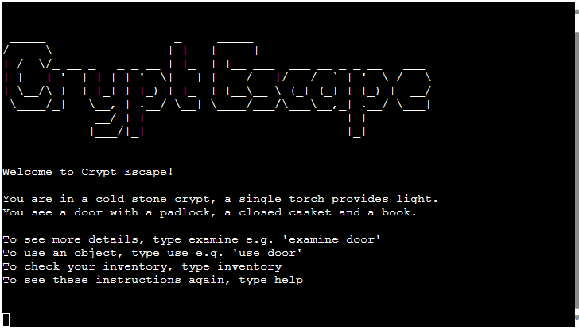
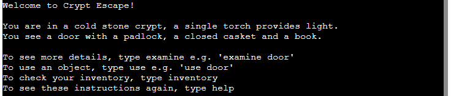
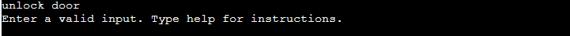
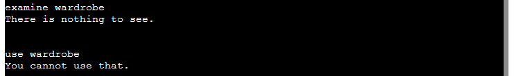

# Crypt Escape

[Link to the Heroku app](https://crypt-escape-93649c26e938.herokuapp.com/)

## Table of Contents
- [Introduction](#introduction)
- [User Stories](#user-stories)
- [Features](#features)

## Introduction

The Crypt Escape project is a Python command line application that emulates an 'escape room' in a text-based format.

The player can interact with the game by entering an input into the terminal describing what they would like to do.

## User Stories

- As a user, I need clear instructions on how to interact with the game.
- As a user, I need feedback when I have entered an invalid command.
- As a user with an interest in games, I need an experience that is familiar but not too easy.

## Features

- Game Title

    - A large ASCII art title that displays on initiation of the game to provide an introduction to the player.

- Room Description and Instructions

    - Provides a description of the room to set the scene and inform the player of what items are in the room.
    - Provides a set of instructions describing what actions the player can take, with examples for the examine and use actions.

- Input Validation

    - The application will take the users input and check it against a number of cases to determine whether or not the input is valid.
    - If the input command is not recognised, the application will provide feedback to the user and request a valid input.

    
    
    - If the input command is valid, but there is no specific command for that case then the application will provide feedback to let the user know that there is nothing to see or that item cannot be used.

    

    - If the input command is valid, and the specific case exists then the application will feedback to the user with a description of what happens when they take that action.

    

### Future Features

To be completed.

# Testing

## Validator Testing

I passed all files through Code Institute's Python PEP8 Linter, which can be found [here](https://pep8ci.herokuapp.com/#).

The run.py and utils.py files both pass with no errors found.

The constants.py file had whitespace errors related to the ASCII art. As these errors had no impact on the code, and were necessary for the ASCII, they were deemed acceptable.

