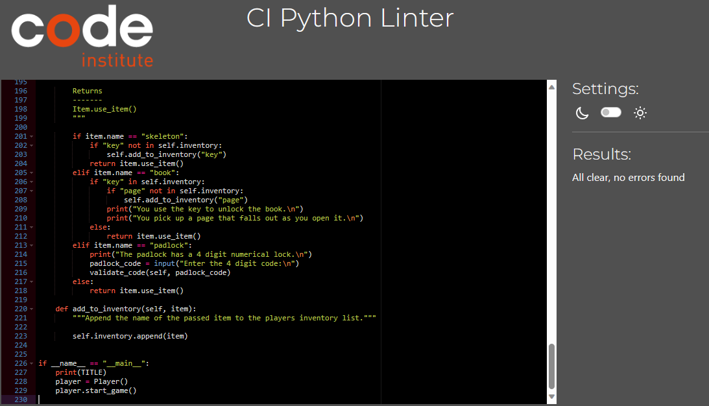
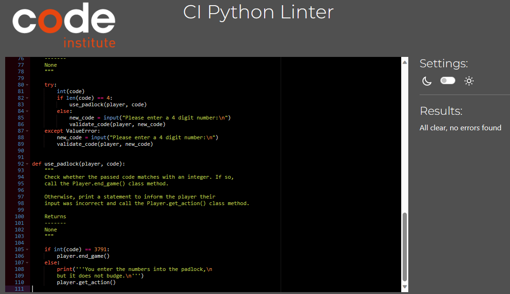
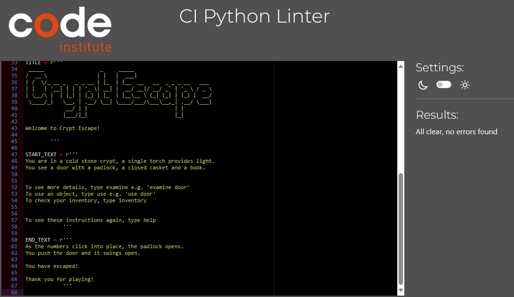
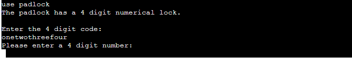
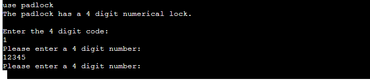
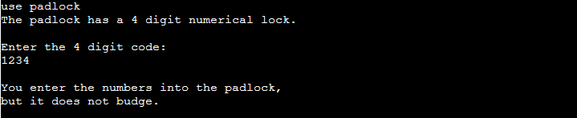

# Crypt Escape

[Link to the Heroku app](https://crypt-escape-93649c26e938.herokuapp.com/)

## Table of Contents
- [Introduction](#introduction)
- [User Stories](#user-stories)
- [Features](#features)
- [Testing](#testing)

## Introduction

The Crypt Escape project is a Python command line application that emulates an 'escape room' in a text-based format.

The player can interact with the game by entering an input into the terminal describing what they would like to do.

## User Stories

- As a user, I need clear instructions on how to interact with the game.
- As a user, I need feedback when I have entered an invalid command.
- As a user with an interest in games, I need an experience that is familiar but not too easy.

## Features

- Game Title

    - A large ASCII art title that displays on initiation of the game to provide an introduction to the player.

- Room Description and Instructions

    - Provides a description of the room to set the scene and inform the player of what items are in the room.
    - Provides a set of instructions describing what actions the player can take, with examples for the examine and use actions.

- Player Input

    - The player provides a keyboard input to the application to determine the next course of action. The application validates the input and ensures it follows the format provided in the instructions.
    - See the [Testing](#testing) section for further details.

### Future Features

To be completed.

# Testing

## Validator Testing

I passed all files through Code Institute's Python PEP8 Linter, which can be found [here](https://pep8ci.herokuapp.com/#).

All files passed with no issues found.

PEP8 Validation - run.py

PEP8 Validation - utils.py

PEP8 Validation - constants.py

## Manual Tests

In order to make sure the game runs smoothly, several validation cases were used and tested continuously throughout development. Feedback is provided to the player so that they are informed what input the game requires in order to continue.

- If an input is not recognised, the application will provide feedback to the user and request a valid input.

    

    
Feedback for an invalid input

    

    

- If the player enters a valid input, but no specific case for the input exists then the application will provide feedback to let the user know that there is nothing to see or that item cannot be used.

    

    
Feedback for a valid input but no specific case

    

    

- If the player enters a valid input, and the specific case exists then the application will provide feedback to the user with a description of what happens when they take that action.

    

    
Feedback for valid input

    

    

- When using the padlock, if the player enters text or a number that has fewer than or more than 4 digits then the application will provide feedback to the user requesting a 4 digit number.

    

    
Feedback for invalid input into padlock

    
    

    

- When using the padlock, if an invalid code is entered then a message will be displayed to indicate the code was incorrect. The player can then perform another action.

    

    
Feedback for incorrect padlock code

    

    
