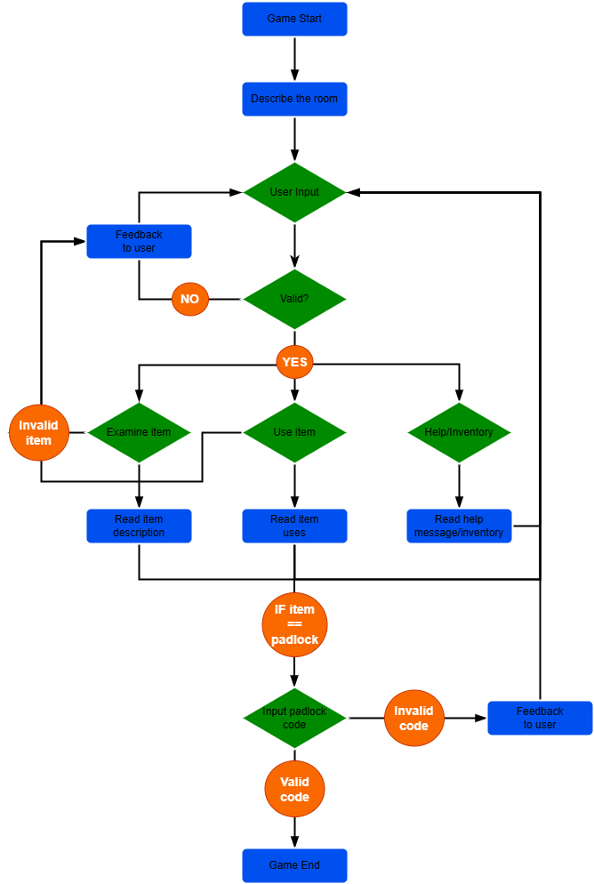
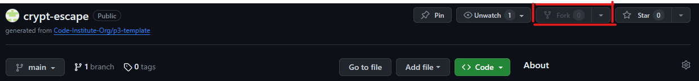

# Crypt Escape

[Link to the Heroku app](https://crypt-escape-93649c26e938.herokuapp.com/)

## Table of Contents
- [Introduction](#introduction)
- [User Stories](#user-stories)
- [Features](#features)
- [Testing](#testing)

## Introduction

The Crypt Escape project is a Python command line application that emulates an 'escape room' in a text-based format.

The player can interact with the game by entering an input into the terminal describing what they would like to do.

## User Stories

- As a user, I need clear instructions on how to interact with the game.
- As a user, I need feedback when I have entered an invalid command.
- As a user with an interest in games, I need an experience that is familiar but not too easy.

## Planning

To plan out the logic of the application, a flowchart was created using [draw.io](https://app.diagrams.net/).

## Features

- Game Title

    - A large ASCII art title that displays on initiation of the game to provide an introduction to the player.

- Room Description and Instructions

    - Provides a description of the room to set the scene and inform the player of what items are in the room.
    - Provides a set of instructions describing what actions the player can take, with examples for the examine and use actions.

- Player Input

    - The player provides a keyboard input to the application to determine the next course of action. The application validates the input and ensures it follows the format provided in the instructions.
    - See the [Testing](#testing) section for further details.

## Future Features

To be completed.

# Testing

## Validator Testing

I passed all files through Code Institute's Python PEP8 Linter, which can be found [here](https://pep8ci.herokuapp.com/#).

All files passed with no issues found.

PEP8 Validation - run.py

PEP8 Validation - utils.py

PEP8 Validation - constants.py

## Manual Tests

In order to make sure the game runs smoothly, several validation cases were used and tested continuously throughout development. Feedback is provided to the player so that they are informed what input the game requires in order to continue.

- If an input is not recognised, the application will provide feedback to the user and request a valid input.

    

    
Feedback for an invalid input

    

    

- If the player enters a valid input, but no specific case for the input exists then the application will provide feedback to let the user know that there is nothing to see or that item cannot be used.

    

    
Feedback for a valid input but no specific case

    

    

- If the player enters a valid input, and the specific case exists then the application will provide feedback to the user with a description of what happens when they take that action.

    

    
Feedback for valid input

    

    

- When using the padlock, if the player enters text or a number that has fewer than or more than 4 digits then the application will provide feedback to the user requesting a 4 digit number.

    

    
Feedback for invalid input into padlock

    
    

    

- When using the padlock, if an invalid code is entered then a message will be displayed to indicate the code was incorrect. The player can then perform another action.

    

    
Feedback for incorrect padlock code

    

    

# Deployment

The application was deployed using [Heroku](https://www.heroku.com/) following the procedure documented below.

1. Log into Heroku or create an account.
2. From the dashboard, click the **New** button in the top right and from the drop down menu select **Create new app**. If no apps have been created previously, the **Create new app** button can be selected directly from the dashboard home screen.
3. Choose a name for the app (this must be unique, for this app the name 'crypt-escape' was chosen) and select the relevant region (in the case of this app, Europe), then press the **Create app** button.
4. Navigate to the **Settings** tab. The tabs can be found at the top of the page underneath the header.
5. Scroll down to the **Config Vars** section and click the **Reveal Config Vars** button.
6. If the application uses any data that is not included in the GitHub repository (ie sensitive data) then it can be included here. For this app, the key "PORT" and value "8000" were entered.
7. Scroll down to the **Buildpacks** section and click the **Add buildpack** button.
8. From the pop-up menu, the select 'Python' and then click the **Add Buildpack** button.
9. Repeat this process for 'node.js'.
10. **IMPORTANT :** In the buildpack section, the two buildpacks should be visible with the python buildpack above the node.js buildpack. If the buildpacks are not in this order, they can be re-arranged by dragging the hamburger icon located to the left of the buildpack name.
11. At the top of the page, navigate to the **Deploy** tab.
12. Scroll down to the **Deployment method** section and select GitHub.
13. Confirm the connection to GitHub by clicking the **Connect to GitHub** button.
14. In the new box that has appeared, enter the repository name and click the **Search** button.
15. When Heroku has found the correct repository, click the **Connect** button that appears below the search bar.
16. Scroll down to the bottom of the Deploy page and select one of the two deployment options:
    * In the Automatic deploy section, select the appropriate branch from the dropdown menu and click the **Enable Automatic Deploys** button. This will deploy the app automatically when an update is pushed to GitHub.
    * In the Manual deploy section, select the appropriate branch from the dropwdown menu and click the **Deploy Branch** button. This will only deploy the current branch. Any further updates will require the app to be re-deployed.

## Forking and Cloning

If you wish to fork and clone this repository, follow the instructions below.

### Forking

1. In the top right of the repository page, click the **Fork** button.
    
2. Under **Owner**, select the desired owner from the dropdown menu.
3. **OPTIONAL :** Change the default name of the repository in order to distinguish it.
3. **OPTIONAL :** In the **Description** field, enter a description for the forked repository.
4. Ensure the 'Copy the main branch only' checkbox is selected.
5. Click the **Create fork** button.

### Cloning the Forked Repository

To clone the fork onto your local system, in your IDE Terminal enter the following command:

    git clone https://github.com/jfpaliga/crypt-escape.git

# Credits

## Content

- The [TextKool](https://textkool.com/en/ascii-art-generator) ASCII art generator was used to generate the title art used in the application.
- The text from the book in the application was taken from J.R.R. Tolkien's The Lord of the Rings: The Fellowship of the Ring.

## Acknowledgements

- I would like to thank my CodeInstitute Mentor, Okwudiri Okoro, for all of his invaluable insight and advice, particularly relating to scalability of code and proper implementation of OOP protocols.